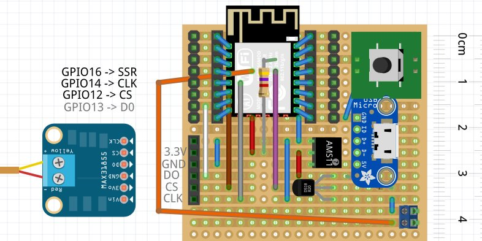

# KilnControl
Control a Kiln with ESP8266.
Temperature is measured by a K-element and "MAX31855" using library from Adafruit.
Control of the device and distribution of status is done via MQTT. I am using node-red to create a front end to the device.
The heating curve can be specified by simple JSON format.

The heating wire of the kiln is controled via SSR (solid state relay). 
The kiln has to be supplied via single wire 230V. 
The SSR is behind a relay, which is connected to a safety switch (only activated if the kiln is closed).
__Dangerous: Do not connect the SSR directly between power supply and heating wire. You might have 230V on the heating wire! __

The ESP modul can be configured via WifiManager.
You have to configure your local WIFI settings, the MQTT server and the "DeviceName".
The program creates a simple web server (port 80) where you can change the "DeviceName" and the MQTT server.

The following messages are distributed via MQTT:
* status : JSON string containing multiple information: 
    "actual", "internal", "desired" and "doHeating"
    
 The program subscribes for the following messages:
 * start : the message can contain any url providing a heating curve in JSON format 
 * stop : stop the current heating process 

Sketch
------

The micro USB connector is just for power supply. To supply the module with 3.3V a AMS1117 voltage regultor is used.
Please note, that the pins RST, EN, GPIO0 are connected to VCC with 4.7 kOhm pull-up resistors
and GPIO15 is connected to GND with 4.7 kOhm pull-down resistor directly on the ESP12F module.
You will not find them in the sketch (see photo of my board.)

The switch on the board just distributes a MQTT message but is not of any use, yet.
I added an additional temperature sensor (DS18B20) to compare it with the internal temperatur of the MAX31855.
(This additional temperature sensor is just for fun.)

Heating Curve
-------------

The JSON object has to have an attribute "curve" which is an array of intervals.
Each interval has attributes: "h" (hours), "m" (minutes), "s" (seconds) and "t" (temperature).
"h", "m" and "s" specify the duration of the interval and "t" is the end temperature of the interval.
(Internally the program starts with 20°C, which is hard coded.)

Example:

    {
        "curve": [
            {
                "h": 0,
                "m": 5,
                "s": 0,
                "t": 600
            },
            {
                "h": 0,
                "m": 5,
                "s": 0,
                "t": 950
            }
        ]
    }
    
Some more pictures:
-
The kiln. On the right side you can see the thermocouple (type K) which I am using. 
Thg gray wire coming out on the top is the control side (low voltage) of the SSR.

Inside of the of the power control. The red thing in the upper left corner is the safety switch, which detects if the kiln is closed.
The blue thing at the bottom is the power relay, which is only active if the red switch is closed.
At the right side you see the SSR, which is controlled by the ESP8266.

The thing in the middle is a bi-metal controlling unit, which allows to set a "heating percentage". 
This unit controls the power relay (together with the safety switch). 
I don't use this unit and maybe I will replace it by another SSR, to be able to activate power remotely.

The thermocouple inside of the kiln.

